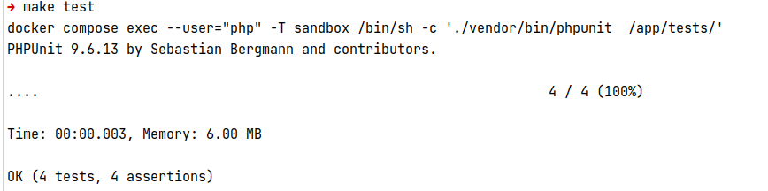
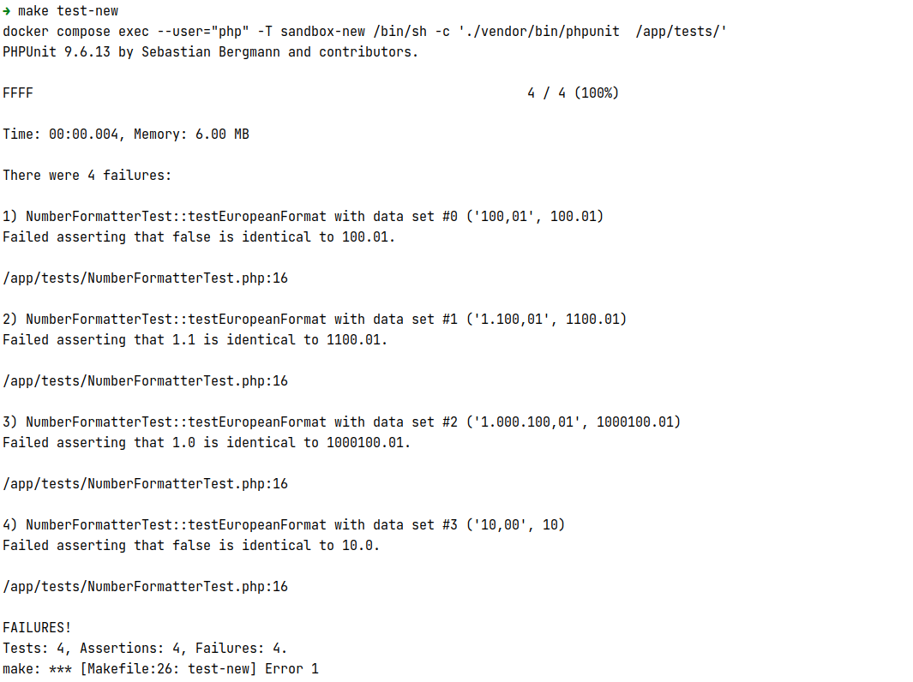

# Reproducing the number formatter issue

> 1. Run `make run` to start the docker containers
> 2. Run `make test` to tun the version with PHP 8.1.3
> 3. Run `make test-new` to tun the version with PHP 8.1.20

```php
$formatter = new NumberFormatter('de_DE', NumberFormatter::DECIMAL);
$result = $formatter->parse('100,01') 

// Expected: 100.01
// Actual: false
```

#### Output for PHP 8.1.3

---


#### Output for PHP 8.1.20

---


